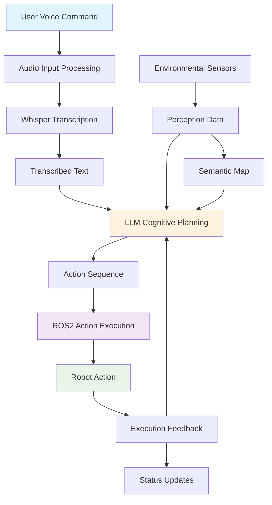
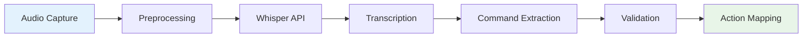
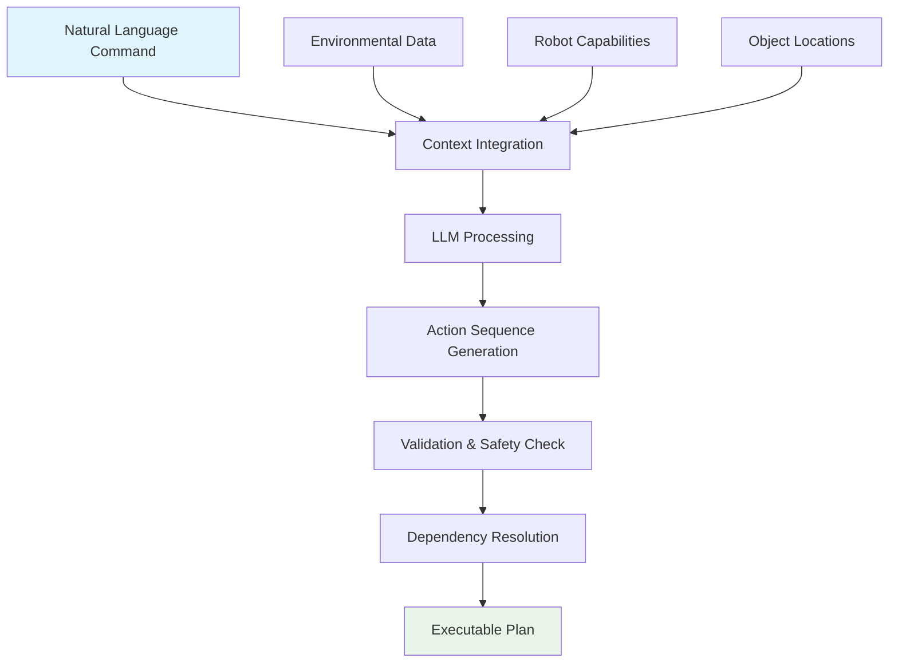
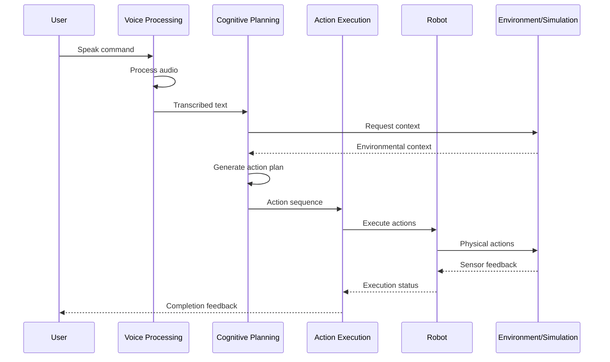
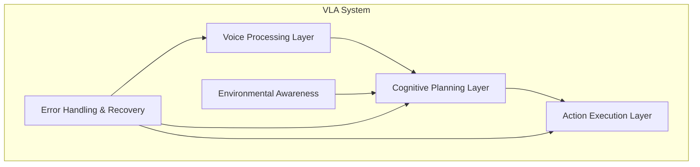
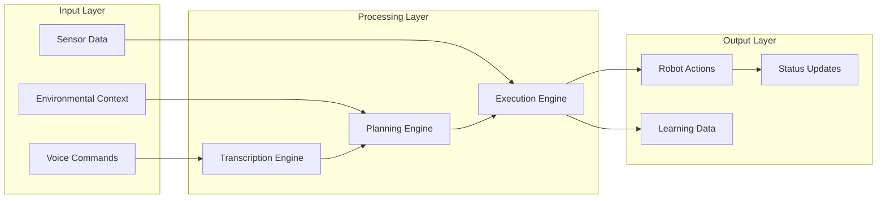
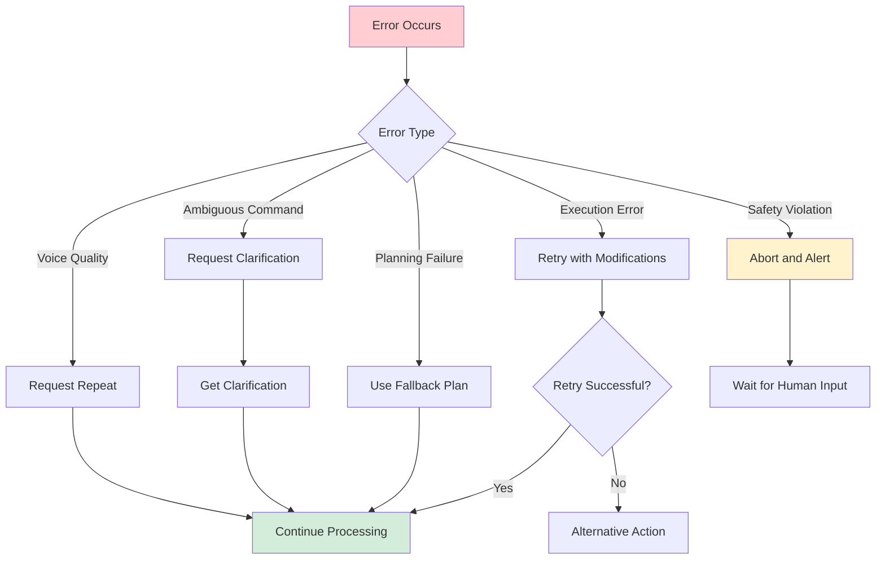

# VLA Pipeline Diagrams and Visualizations

## 1. Complete VLA Pipeline Architecture

## 2. Voice-to-Action Pipeline

## 3. Cognitive Planning Process

## 4. End-to-End System Flow

## 5. Component Architecture

## 6. Data Flow Diagram

## 7. Error Recovery Flow

## 8. Performance Metrics Dashboard

The VLA system tracks these key metrics:

| Metric | Target | Current | Status |
|--------|--------|---------|---------|
| Voice Recognition Accuracy | >90% | TBD | 🔄 |
| Command Planning Success | >85% | TBD | 🔄 |
| Action Execution Success | >95% | TBD | 🔄 |
| End-to-End Latency | &lt;10s | TBD | 🔄 |
| System Availability | >99% | TBD | 🔄 |

These diagrams provide visual representations of the VLA pipeline architecture, data flows, and system interactions to help students understand the complete system structure.