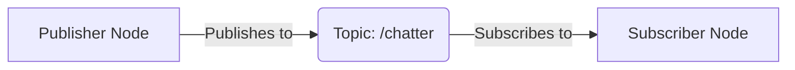
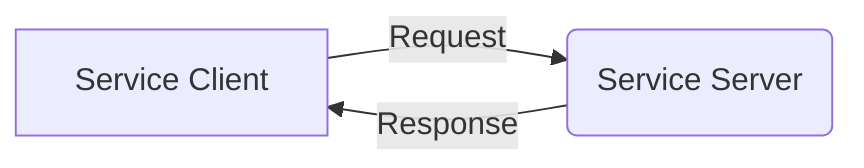

# ROS 2 Core Concepts: Nodes, Topics, and Services

## Overview

Robot Operating System 2 (ROS 2) is a flexible framework for writing robot software. It's a collection of tools, libraries, and conventions that aim to simplify the task of creating complex and robust robot behavior across a wide variety of robot platforms.

ROS 2 is not an operating system, but rather a middleware that provides services designed for a heterogeneous computer cluster. It includes hardware abstraction, device drivers, libraries, visualizers, message-passing, package management, and more.

## Architecture Overview

ROS 2 uses a distributed architecture where multiple processes (potentially on different machines) work together to achieve complex robot behavior. The core concepts that enable this distributed system are:

- **Nodes**: Processes that perform computation
- **Topics**: Communication channels for data streams
- **Services**: Synchronous request/response communication
- **Actions**: Asynchronous request/response communication with feedback

## Nodes

A node is a single executable that uses ROS 2 to communicate with other nodes. Nodes are designed to be simple, single-purpose processes that work together to achieve complex robot behavior. Each node runs in its own process and can communicate with other nodes through topics, services, and actions.

### Node Characteristics

- **Lightweight**: Nodes are designed to be small and focused on a single task
- **Communicative**: Nodes communicate with other nodes through topics, services, and actions
- **Composable**: Multiple nodes can work together to achieve complex behavior
- **Distributed**: Nodes can run on the same machine or across a network

### Creating a Node

In ROS 2, nodes are created by extending the `rclpy.Node` class in Python or `rclcpp::Node` class in C++. Each node must have a unique name within the ROS 2 domain.

```python
import rclpy
from rclpy.node import Node

class MyNode(Node):
    def __init__(self):
        super().__init__('my_node_name')
        # Node initialization code here
```

## Topics and Messages

Topics are named buses over which nodes exchange messages. ROS 2 uses a publish-subscribe communication model where nodes that publish messages to a topic do not need to know which nodes are subscribed to that topic.

### Message Types

Messages are the data structures that are passed between nodes. ROS 2 provides many standard message types and allows users to define custom message types. Messages are defined using `.msg` files that specify the data fields.

Common message types include:
- `std_msgs`: Basic data types (Int32, String, Float64, etc.)
- `geometry_msgs`: Geometric primitives (Point, Pose, Twist, etc.)
- `sensor_msgs`: Sensor data (LaserScan, Image, JointState, etc.)
- `nav_msgs`: Navigation-specific messages (Odometry, Path, etc.)

### Publisher-Subscriber Pattern

In the publisher-subscriber pattern:

1. **Publisher**: A node that sends messages to a topic
2. **Subscriber**: A node that receives messages from a topic
3. **Topic**: The named channel through which messages flow



### Quality of Service (QoS)

ROS 2 provides Quality of Service settings that allow fine-tuning of communication behavior, including:
- Reliability (reliable vs. best-effort)
- Durability (transient-local vs. volatile)
- History (keep-all vs. keep-last)
- Deadline and lifespan settings

## Services

Services provide synchronous request/response communication between nodes. When a node calls a service, it sends a request and waits for a response. This is different from topics, which provide asynchronous communication.

### Service Characteristics

- **Synchronous**: The client waits for a response from the server
- **One-to-one**: Typically one server responds to one client at a time
- **Request/Response**: Each call has a request message and a response message
- **Blocking**: The client is blocked until the server responds

### Service Architecture



### Service Types

Service definitions are specified using `.srv` files that define both the request and response message types. For example:

```
# Request message
string name
int32 age
---
# Response message
bool success
string message
```

## Actions

Actions provide asynchronous request/response communication with feedback and goal preemption. They are used for long-running tasks where the client needs periodic feedback about progress.

### Action Characteristics

- **Asynchronous**: The client does not block while waiting for completion
- **Feedback**: The server can send periodic feedback to the client
- **Preemption**: Goals can be canceled or preempted
- **Goal/Result**: Similar to services but with additional feedback

## Communication Patterns Comparison

| Pattern | Type | Synchronization | Use Case |
|---------|------|----------------|----------|
| Topics | Publish-Subscribe | Asynchronous | Continuous data streams |
| Services | Request-Response | Synchronous | Single request/response |
| Actions | Request-Feedback-Result | Asynchronous | Long-running tasks |

## ROS 2 Architecture

ROS 2 uses a DDS (Data Distribution Service) implementation for communication between nodes. DDS provides the underlying infrastructure for the publish-subscribe and client-server communication patterns.

### DDS Implementation Options

ROS 2 supports multiple DDS implementations:
- **Fast DDS** (default): eProsima's implementation
- **Cyclone DDS**: Eclipse implementation
- **RTI Connext DDS**: RTI's implementation
- **OpenSplice DDS**: ADLINK's implementation

## Summary

Understanding these core concepts is fundamental to working with ROS 2. The distributed architecture allows for flexible and robust robot software systems where each component can be developed and tested independently while still working together as a cohesive system.

In the next sections, we'll explore how to implement these concepts using Python and the `rclpy` library.