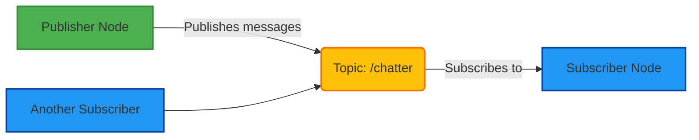
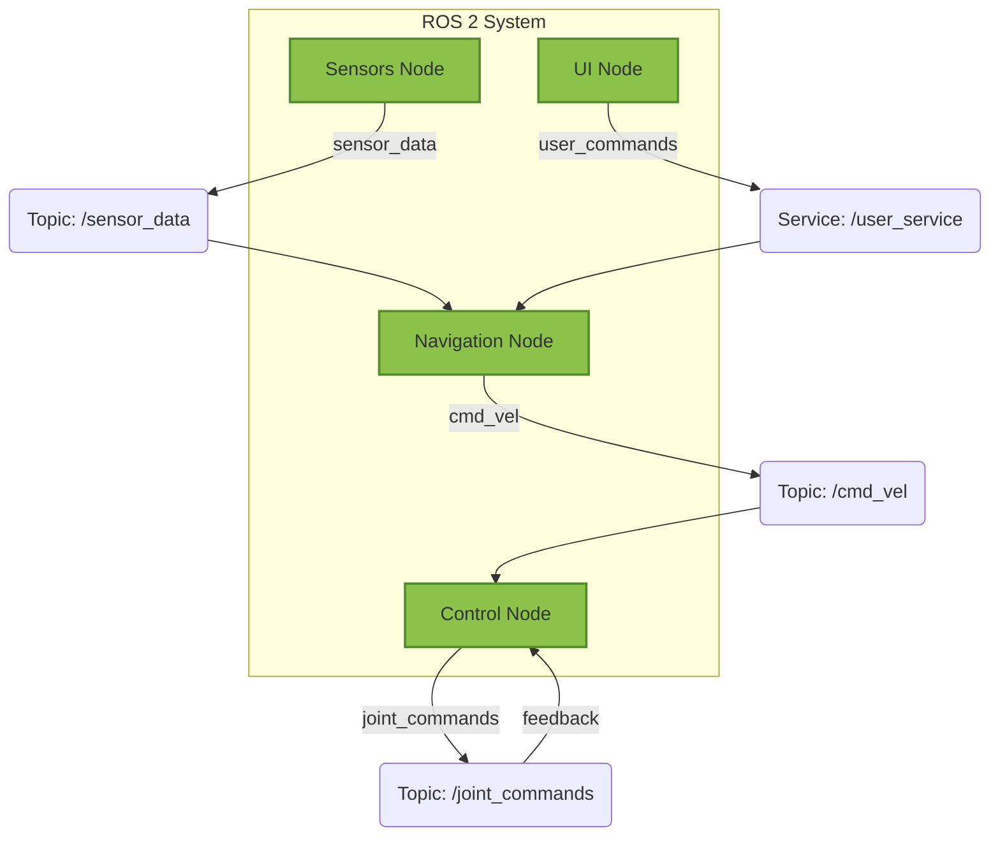
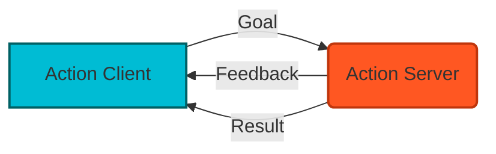
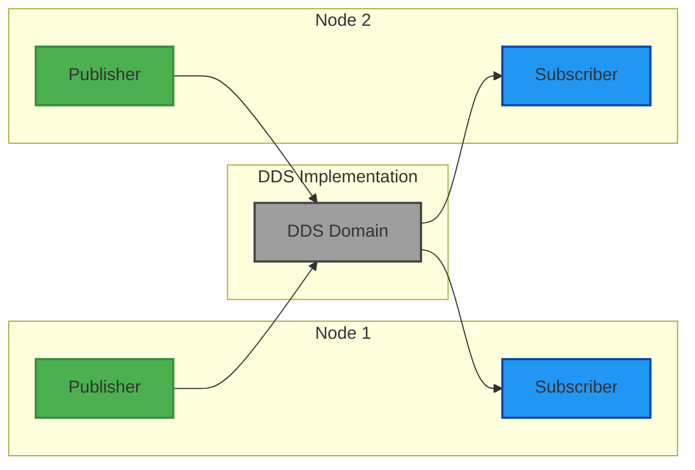

# Mermaid Diagrams for ROS 2 Architecture

## Publisher-Subscriber Communication

This diagram shows the basic publisher-subscriber communication pattern in ROS 2:

## Service Communication

This diagram shows the service client-server communication pattern:

## Node Architecture

This diagram shows the relationship between nodes, topics, and services:

## Action Communication

This diagram shows the action communication pattern with feedback:

## DDS Communication Layer

This diagram shows the underlying DDS communication layer:

